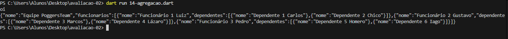

 

# Avaliação-02
## PROFESSOR: Ricardo Duarte Taveira
## ALUNO: Pedro Henrique Alves Barbosa

100 pontos

Data de entrega: 15 de mai.

Implementar as funcionalidades relacionadas na função main () no arquivo fonte do fonte do repositório em 14-agregacao.dart.
Evidenciar o código e o print da saída no GitHub e o link da atividade no Google Classroom.
https://github.com/ricdtaveira/mobdev-parte-01/blob/master/14-poo/14-agregacao.dart
