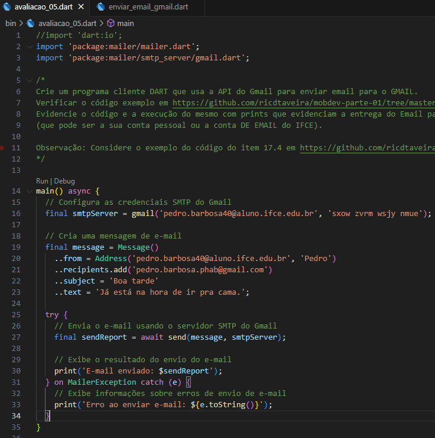
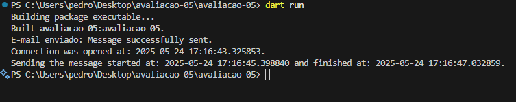

## Evidências de Funcionamento

A seguir, estão as três prints que evidenciam o funcionamento do programa e a entrega do e-mail:

O PDF `prints/avaliacao05.pdf`

### 1. Execução do Programa



### 2. E-mail Recebido na Caixa de Entrada



### 3. Detalhes do E-mail Recebido


## Descrição do Projeto

O programa foi desenvolvido conforme a proposta da avaliação, utilizando o pacote `mailer` para Dart. O envio é realizado através do servidor SMTP do Gmail, com autenticação e configuração de remetente, destinatário, assunto e corpo do e-mail.

O código principal está localizado em `bin/avaliacao_05.dart`.

## Execução do Código

Para executar o projeto:

1. Instale as dependências:
   ```
   dart pub get
   ```
2. Execute o programa:
   ```
   dart run bin/avaliacao_05.dart
   ```
